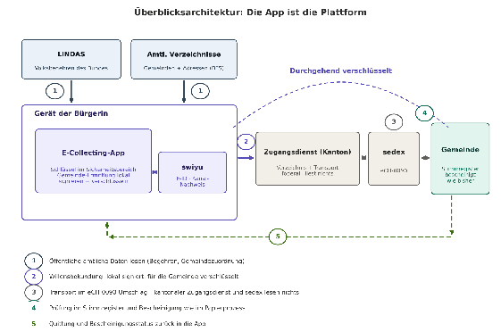
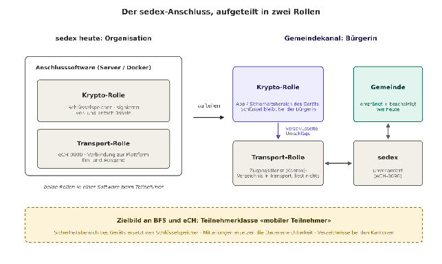
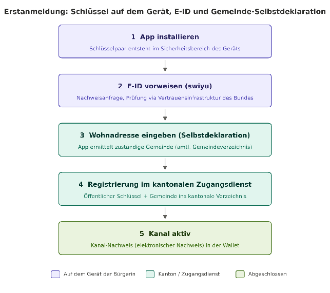
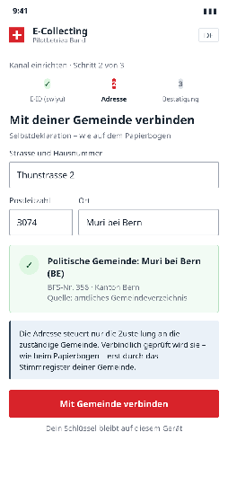
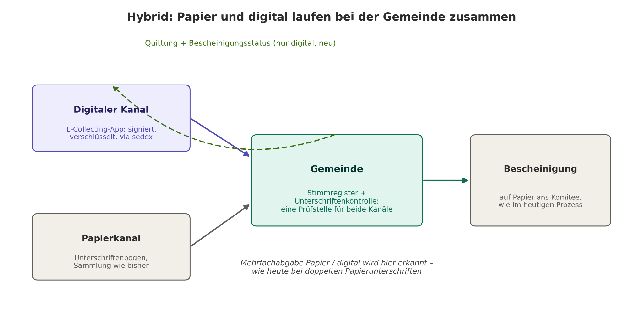
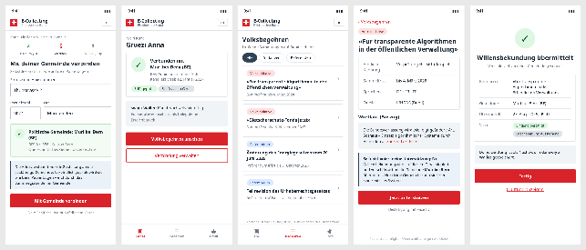

# Dezentrales, flächendeckendes E‑Collecting Grundsystem

## Konzept für die elektronische Unterschriftensammlung mit e-ID und sedex

**Autor:** Sandro Scalco · **Eingabe der** Stiftung für direkte Demokratie · **Stand:** 10. September 2026

Dieses Konzept ist ein Beitrag einer teilnehmenden Person zum partizipativen Prozess der Bundeskanzlei und kein Dokument der Bundeskanzlei. Es baut auf den gemeinsamen Vorarbeiten «Fast Track: Pilotprojekt E-Collecting mit E-ID \- How low can we go?» (Graf/Schönenberger/Scalco/Andrey, Winterkongress 2025\) und dem Konzept V2.1 (Scalco, Mai 2025\) auf. Die vorliegende Weiterentwicklung zum durchgehend dezentralen Modell stammt vom genannten Autor allein; sie ist mit keiner weiteren Person gemeinsam verfasst worden.

***Demo:** [https://ecollecting-decentralized-pilot.lovable.app/](https://ecollecting-decentralized-pilot.lovable.app/)* 

**Inhaltsverzeichnis**

- [**Einleitung**](#einleitung)
- [**Teil 1 \- Das Konzept**](#teil-1---das-konzept)
  - [1 Der Gemeindekanal: ein Service public](#1-der-gemeindekanal-ein-service-public)
  - [2 Einordnung: der Bürgerkanal als fehlendes Stück](#2-einordnung-der-bürgerkanal-als-fehlendes-stück)
  - [3 Das Konzept im Überblick](#3-das-konzept-im-überblick)
- [**Teil 2 \- Vertiefung der Komponenten**](#teil-2---vertiefung-der-komponenten)
  - [4 sedex: vom Behördennetz zum Bürgerkanal](#4-sedex-vom-behördennetz-zum-bürgerkanal)
  - [5 Erstanmeldung mit der E-ID und Schlüssel auf dem Gerät](#5-erstanmeldung-mit-der-e-id-und-schlüssel-auf-dem-gerät)
  - [6 Selbstdeklaration und Gemeindezuordnung](#6-selbstdeklaration-und-gemeindezuordnung)
  - [7 Volksbegehren aus LINDAS](#7-volksbegehren-aus-lindas)
  - [8 Übermittlung und Signatur](#8-übermittlung-und-signatur)
  - [9 Gemeindeseite: Bescheinigung wie bisher](#9-gemeindeseite-bescheinigung-wie-bisher)
  - [10 Sammelnde Akteur:innen, Sammellink und «Liste 0»](#10-sammelnde-akteurinnen-sammellink-und-liste-0)
  - [11 Rolle der Bundeskanzlei](#11-rolle-der-bundeskanzlei)
  - [12 Sicherheit, Datenschutz, Missbrauch](#12-sicherheit-datenschutz-missbrauch)
- [**Anhang**](#anhang)
  - [A Datenabfragen LINDAS](#a-datenabfragen-lindas)
  - [B eCH-Landkarte](#b-ech-landkarte)
  - [C Technisches Beispiel (illustrativ)](#c-technisches-beispiel-illustrativ)
  - [D App-Bildschirmentwürfe (Design-System des Bundes)](#d-app-bildschirmentwürfe-design-system-des-bundes)
  - [E Referenzen](#e-referenzen)

# Einleitung

Mit sieben gleichlautenden Motionen «Pilotbetrieb für E-Collecting mit der E-ID-Vertrauensinfrastruktur» (24.3905-24.3912, u.a. 24.3907 Andrey) verlangt das Parlament seit September 2024 einen eingegrenzten Pilotbetrieb für die elektronische Unterschriftensammlung unter realen Bedingungen. Der Bundesrat empfiehlt die Annahme; der Nationalrat hat die Motionen deutlich überwiesen. Parallel dazu hat der Bundesrat am 30\. April 2025 die Botschaft zur Teilrevision des Bundesgesetzes über die politischen Rechte verabschiedet (Geschäft 25.047), die im BPR eine gesetzliche Grundlage für Versuche mit E-Collecting schafft \- zulässig bei fakultativen Referenden, Volksinitiativen und Wahlvorschlägen für die Nationalratswahlen.

Die Motionen formulieren dabei drei Anforderungen, die über das «Ob» hinaus das «Wie» festlegen: Die Umsetzung soll datensparsam, dezentral und quelloffen erfolgen \- und technisch so einfach wie möglich, als bewusst kleiner erster Schritt (Minimum Viable Product). Das vorliegende Konzept nimmt diesen Auftrag wörtlich. Es beschreibt ein E-Collecting, das ohne zentrale Plattform auskommt: Die «Plattform» ist die App auf dem Gerät der stimmberechtigten Person. Dort entsteht der kryptografische Schlüssel, dort wird die zuständige Gemeinde ermittelt, und von dort wird die Willensbekundung über die bewährte sedex-Infrastruktur des Bundes direkt an die Gemeinde übermittelt \- dieselbe Infrastruktur, über die die Gemeinden heute schon täglich Meldungen austauschen. Für die Gemeinden entsteht kein neuer Prozess: Sie bescheinigen wie bisher. Und weil sedex bereits heute sämtliche Gemeinden der Schweiz verbindet und die einfachste Integrationsstufe ohne jede Softwareanpassung auskommt, ist der Ansatz vom ersten Tag an flächendeckend: teilnahmefähig ist jede Gemeinde, mitmachen kann jede Person mit E-ID.

Das Konzept versteht sich als Beitrag zum laufenden partizipativen Prozess der Bundeskanzlei. Es baut auf den Vorarbeiten «How low can we go?» (Winterkongress 2025, Konzept V2.1) auf und entwickelt sie in einem Punkt entscheidend weiter: weg von der zentralen E-Collecting-Plattform, hin zu einem durchgehend dezentralen, föderal organisierten Modell. Teil 1 (Kapitel 1-3) erklärt das Konzept und verankert es in der E-Government-Forschung; Teil 2 (Kapitel 4-12) vertieft die einzelnen Komponenten.


# Teil 1 \- Das Konzept

## 1 Der Gemeindekanal: ein Service public

Wer heute mit seiner Gemeinde kommunizieren will, hat die Wahl zwischen Schalter, Brief, Telefon und \- je nach Gemeinde \- einem Web-Formular oder E-Mail. Was fehlt, ist das Selbstverständliche: ein direkter, sicherer, verschlüsselter Kanal zwischen jeder Einwohnerin und ihrer Gemeinde, so alltäglich wie der Briefkasten am Haus. Die Bausteine dafür existieren: sedex verbindet als verschlüsselte Austauschplattform des Bundes seit 2008 alle Gemeinden, Kantone und Bundesstellen \- nur die Bürgerinnen und Bürger sind nicht angeschlossen. Mit der vom Volk am 28\. September 2025 beschlossenen E-ID kommt der zweite Baustein: die staatlich geprüfte Identität in der swiyu-App auf dem eigenen Gerät.

Dieses Konzept verbindet beides zum Gemeindekanal: Eine App, in der die Bürgerin sich einmalig mit der E-ID ausweist, ihre Wohnadresse deklariert und damit kryptografisch mit ihrer politischen Gemeinde verbunden wird. Der Schlüssel dazu liegt ausschliesslich auf ihrem Gerät \- niemand sonst kann in ihrem Namen kommunizieren, niemand kann mitlesen. Die Behörden kommunizieren untereinander längst sicher; mit dem Gemeindekanal tun sie es auch mit der Bevölkerung.

E-Collecting ist der erste Anwendungsfall dieses Kanals \- bewusst gewählt, weil er den höchsten Anspruch an Identität, Integrität und Vertrauen stellt. Was für Volksbegehren sicher genug ist, trägt auch Umzugsmeldung, Fristenmitteilung oder Behördenpost. Der Gemeindekanal ist darum mehr als ein Projektbaustein: Er ist als Service public zu denken \- eine Grundinfrastruktur der digitalen Schweiz, die politisch eingefordert werden soll.

## 2 Einordnung: der Bürgerkanal als fehlendes Stück

Die E-Government-Forschung unterscheidet vier Beziehungen, in denen eine Verwaltung elektronisch handelt: zwischen Behörde und Bürgerinnen (Government-to-Citizens, G2C) als Zugang zu öffentlichen Diensten und Informationen; zwischen Behörde und Unternehmen (G2B) zur Senkung des Verwaltungsaufwands; zwischen den Behörden selbst (G2G) für die Zusammenarbeit über Ämter und Staatsebenen hinweg; sowie innerhalb der Verwaltung gegenüber den Mitarbeitenden (G2E) (Otieno/Omwenga 2015). E-Government meint dabei nach der OECD-Definition den Einsatz der Informations- und Kommunikationstechnik über das gesamte Spektrum staatlicher Aufgaben \- mit besonderem Gewicht auf dem Netzwerkpotenzial des Internets (OECD 2002).

Aufschlussreich wird diese Einteilung im Architekturmodell: Nach dem Schichtenmodell von Ebrahim/Irani (2005) baut E-Government von der Infrastruktur über die Fach- und Verbindungsschichten bis zur Zugangsschicht auf, an der Bürgerinnen und Unternehmen andocken. Legt man dieses Modell über die Schweiz, entsteht ein präzises Bild: Die unteren Schichten sind stark \- harmonisierte Register, eCH-Standards als gemeinsame Sprache, und mit sedex ein Behördennetz, das seit 2008 produktiv sämtliche Gemeinden, Kantone und Bundesstellen verbindet. Was fehlt, ist die standardisierte, sichere Zugangsschicht zur Bürgerin: Es gibt keinen Bürgerkanal, der die Qualitäten des Behördennetzes \- durchgehende Verschlüsselung, Quittungen, Verbindlichkeit \- bis auf das Gerät der Bürgerin verlängert. In der Sprache der E-Government-Architektur ist dieser Kanal das fehlende Stück der Schweiz.

Die empirischen Befunde stützen diese Diagnose seit Jahren. Der E-Government-Vergleich der Europäischen Kommission attestierte der Schweiz Rückstand hinter dem EU-Durchschnitt in fast allen Lebenslagen \- und nannte das Fehlen einer elektronischen Identität als Schlüsselfaktor dafür (Capgemini et al. 2018). Im Schweizer Civictech-Umfeld fällt im internationalen Vergleich zudem das Fehlen einer Datenaustauschplattform auf, wie sie Estland mit X-Road betreibt: einer staatlichen Verbindungsschicht, an die neben Behörden auch Dienste für die Bevölkerung anschliessen (e-Estonia, o.J.). Typisch für den daraus folgenden «Digitalisierungsstau» ist die Elektrifizierung statt Digitalisierung: Bestehende Papierprozesse werden als Webformular mit PDF-Versand nachgebaut, statt die Abläufe über einen sicheren Kanal neu zu denken (Scalco 2020).

Dass die Lücke schliessbar ist, zeigte bereits die Fallstudie Schaffhausen: Der Kanton führte 2018 als erster eine kantonale elektronische Identität ein \- gemeinsam mit der Bevölkerung entwickelt (Andermatt/Göldi 2018; Evaluation: Mertes/Pleger 2018\) \- und der darauf aufbauende E-Collecting-Prototyp «sh-collect» wies die technische Machbarkeit der digitalen Unterstützung von Volksbegehren nach. Als fehlende Stücke blieben damals zwei Dinge: die Gesetzesgrundlage für die digitale Unterschrift und ein sicherer, standardisierter Kanal zwischen Bürgerin und Behörde (Scalco 2020). Sechs Jahre später sind beide Lücken adressierbar: Die E-ID des Bundes liefert die Identität, die BPR-Teilrevision die Versuchsrechtsgrundlage \- und das vorliegende Konzept das dritte Stück: den Bürgerkanal, gebaut als Erweiterung des bewährten Behördennetzes sedex statt als neue Parallelplattform. Das ist, föderal gedacht, die Schweizer Antwort auf X-Road.


## 3 Das Konzept im Überblick

Das Konzept beruht auf einer einzigen Verschiebung: Die E-Collecting-«Plattform» ist keine zentrale Website des Bundes, sondern die App auf dem Gerät der stimmberechtigten Person. Alles, was eine Plattform ausmacht \- Identität, Schlüssel, Gemeindezuordnung, Erstellung der Willensbekundung \- passiert lokal. Gemeinsam bleibt nur, was zwingend gemeinsam sein muss: der Transport über sedex und ein Verzeichnis der öffentlichen Schlüssel \- geführt von den Kantonen, jeder für seine Bevölkerung.

**Der Ablauf aus Sicht der Bürgerin in fünf Schritten.**

1. Die Bürgerin installiert die App; im geschützten Sicherheitsbereich ihres Geräts entsteht ein Schlüsselpaar \- der private Schlüssel verlässt das Gerät nie.  
2. Sie weist sich einmalig mit der E-ID aus (swiyu, Nachweisanfrage); die AHV-Nummer wird dabei an ihren öffentlichen Schlüssel gebunden.  
3. Sie deklariert ihre Wohnadresse; die App ermittelt daraus lokal die politische Gemeinde (BFS-Gemeindenummer, amtliches Gemeindeverzeichnis) und richtet die Verbindung über den Zugangsdienst ihres Kantons ein. Die App zeigt: «Du bist mit \[Gemeinde\] verbunden.»  
4. Die App lädt die laufenden Volksbegehren live aus LINDAS, dem Datendienst des Bundes \- Referenden in laufender Sammelfrist, Initiativen im Sammelstadium, mehrsprachig, mit amtlichen Kennungen. Die Bürgerin wählt ein Begehren und bestätigt mit Biometrie oder PIN.  
5. Ihr Gerät signiert die Willensbekundung, verschlüsselt sie für die Gemeinde und übergibt sie dem kantonalen Zugangsdienst, der sie als sedex-Meldung (eCH-0090) zustellt. Die Gemeinde bescheinigt wie bisher; die Bürgerin erhält über denselben Kanal eine Quittung in die App.

***Demo:** [https://ecollecting-decentralized-pilot.lovable.app/](https://ecollecting-decentralized-pilot.lovable.app/)*



Abbildung 1: Überblicksarchitektur \- die App ist die Plattform

**Fünf Grundprinzipien.**

- **Dezentral und föderal:** Schlüssel und Fachlogik liegen an den Endpunkten (Gerät, Gemeinde); die Mitte transportiert nur. Die Verzeichnisse führen die Kantone \- wie Stimm- und Einwohnerregister. Ein zentrales Personenregister des Bundes entsteht nicht.  
- **Datensparsam:** Übermittelt wird das Minimum des heutigen Unterschriftenbogens \- Begehren, Personenangaben nach eCH-0044, Zeitstempel; es entsteht keine zentrale Gesinnungsdatenbank, weil keine zentrale Stelle Inhalte lesen kann.  
- **Quelloffen:** App, Zugangsdienst und Formate werden als Open Source publiziert; die Prüfung einer Willensbekundung ist mit dem öffentlichen Schlüssel der Bürgerin für jede Stelle nachvollziehbar.  
- **Flächendeckend:** sedex verbindet bereits alle Gemeinden, und Integrationsstufe A (Kapitel 9\) verlangt keinerlei Softwareanpassung \- Versuche müssen darum nicht auf einzelne Pilotgemeinden beschränkt bleiben, sondern stehen vom ersten Tag an jeder Gemeinde offen.  
- **Papier bleibt:** Der analoge Weg wird nicht angetastet \- die Gemeinde behandelt digitale Eingänge wie Papier, inklusive des vertrauten Bogen-Layouts als PDF. Die Bildschirmentwürfe in Anhang D zeigen, wie sich das Konzept im Design-System des Bundes anfühlt.

# Teil 2 \- Vertiefung der Komponenten

## 4 sedex: vom Behördennetz zum Bürgerkanal

sedex (secure data exchange) ist seit dem 15\. Januar 2008 die Datenaustauschplattform des Bundesamts für Statistik und verbindet heute über 8'000 Organisationseinheiten in mehr als 80 Fachbereichen (Domänen) \- Einwohnerdienste, Kantone, Bundesregister; im Jahr 2020 wurden über 22,5 Millionen Meldungen übermittelt. Die Plattform funktioniert wie ein eingeschriebener Brief: zeitversetzt, mit Quittungen, rund um die Uhr verfügbar. Jede Meldung reist in einem standardisierten Umschlag (eCH-0090) mit Absender- und Empfänger-Kennung; der Inhalt \- beliebige Formate, von XML bis PDF \- wird so verschlüsselt, dass nur der Empfänger ihn öffnen kann: Die Zertifikate stammen aus der Swiss Government PKI, die privaten Schlüssel werden beim Teilnehmer erzeugt und verlassen ihn nie. sedex kennt zudem physische Teilnehmer (mit eigener Anschlusssoftware und eigenem Zertifikat) und logische Teilnehmer, die über einen physischen erreichbar sind.

Genau diese drei Eigenschaften \- Schlüssel beim Teilnehmer, einheitlicher Umschlag, logische Teilnehmer \- machen sedex zur idealen Basis für den Gemeindekanal. Was fehlt, ist einzig die letzte Meile: Bürgerinnen sind keine Teilnehmerinnen. Der Ausbau vom Behördennetz zum Bürgerkanal (Kapitel 2\) erfolgt darum nicht durch einen Umbau von sedex, sondern durch eine Aufteilung der Anschlusssoftware (Adapter) in zwei Rollen: Die App übernimmt die kryptografische Rolle \- Schlüssel im Sicherheitsbereich des Geräts, Signieren, Ver- und Entschlüsseln. Ein schlanker Zugangsdienst übernimmt die Transportrolle: Er ist der physische sedex-Teilnehmer, führt die Bürgerinnen als logische Teilnehmende, bewegt verschlüsselte Umschläge \- und liest nichts.

Der Zugangsdienst ist föderal organisiert, so wie es die Zuständigkeit für Stimm- und Einwohnerregister vorgibt: Jeder Kanton führt das Verzeichnis der öffentlichen Schlüssel für seine Bevölkerung und betreibt die zugehörige Zugangsstelle \- allein, im Verbund mit anderen Kantonen oder über die eOperations Schweiz AG, das gemeinsame Betriebsvehikel von Bund, Kantonen und Gemeinden. Der Bund stellt den Standard (eCH), den Transport (sedex) und eine quelloffene Referenzsoftware bereit; die Rechtsgrundlage dafür bietet das seit 1\. Januar 2024 geltende EMBAG, das dem Bund die Bereitstellung von Informatikmitteln für die Kantone (Art. 11\) und Pilotversuche (Art. 15\) ausdrücklich erlaubt. Die App ermittelt aus der Gemeindezuordnung automatisch den zuständigen Kanton; ein Umzug über die Kantonsgrenze überträgt den Verzeichniseintrag entlang des bestehenden Meldewesens (eUmzug, eCH-0020). Damit spiegelt der Gemeindekanal die föderale Ordnung, statt sie zu umgehen \- und es entsteht kein zentrales Personenregister des Bundes. Materiell ist die Bürgerin die Teilnehmerin: Nur ihr Gerät kann in ihrem Namen signieren, nur ihr Gerät kann lesen, was an sie gerichtet ist. Ein eigener sedex-Anschluss pro App wäre die reine Lehre \- die föderale Aufteilung ist ihre pragmatische Entsprechung, umsetzbar ohne Änderung am sedex-Betriebsmodell. Als Zielbild formuliert das Konzept die Forderung an BFS und eCH, eine Teilnehmerklasse «mobiler Teilnehmer» zu prüfen, bei der der Sicherheitsbereich des Geräts den Schlüsselspeicher der Anschlusssoftware ersetzt und Mitteilungen aufs Gerät die Dauererreichbarkeit.



Abbildung 2: Der sedex-Anschluss, aufgeteilt in kryptografische Rolle (Gerät) und Transportrolle (kantonaler Zugangsdienst)

|  | sedex heute (Behördennetz) | Gemeindekanal (Bürgerkanal) |
| :---- | :---- | :---- |
| Teilnehmer | Organisationen (Vertrag mit BFS) | Bürgerinnen als logische Teilnehmende |
| Schlüssel | beim Teilnehmer erzeugt, im Schlüsselspeicher der Anschlusssoftware | im Sicherheitsbereich des Geräts erzeugt |
| Endpunkt | Anschlusssoftware (Server / Docker) | App \+ kantonaler Zugangsdienst (Transport) |
| Identität | Organisationszertifikat (Swiss Government PKI) | E-ID-gebundener Geräteschlüssel |
| Adressierung | sedex-ID | Teilnehmer-Kennung im kantonalen Verzeichnis |
| Umschlag | eCH-0090 | eCH-0090 (unverändert) |

Tabelle 1: sedex heute und als Gemeindekanal

## 5 Erstanmeldung mit der E-ID und Schlüssel auf dem Gerät

Beim ersten Start erzeugt die App ein Schlüsselpaar im geschützten Sicherheitsbereich des Geräts (Secure Element, Verfahren ECDSA P-256). Der private Schlüssel ist an die Hardware gebunden, durch Biometrie oder PIN geschützt und verlässt das Gerät nie \- er kann nicht exportiert, kopiert oder ausgelesen werden. Damit gilt auf dem Smartphone dasselbe Prinzip, das sedex seit 2008 für Organisationen kennt: Der Schlüssel entsteht beim Teilnehmer und bleibt dort.

Im zweiten Schritt weist sich die Person mit ihrer E-ID aus. Die App stellt über swiyu eine Nachweisanfrage mit minimaler Attributauswahl: die AHV-Nummer als eindeutiges Merkmal sowie Name, Vorname und Geburtsdatum gemäss eCH-0044. Der kantonale Zugangsdienst ist als Prüfstelle im öffentlichen Register des Bundes eingetragen; Umfang und Zweck der Abfrage sind dort deklariert \- fehlt diese Registrierung, warnt die swiyu-App. Die E-ID wird ausschliesslich für diesen einmaligen Bindungsvorgang vorgewiesen: Der Zugangsdienst prüft den Nachweis gegen die Vertrauensinfrastruktur des Bundes und trägt im kantonalen Verzeichnis den öffentlichen Schlüssel mit einer neu vergebenen, pseudonymen Teilnehmer-Kennung ein. Die AHV-Nummer wird nicht im Verzeichnis abgelegt \- sie wandert später ausschliesslich in der für die Gemeinde verschlüsselten Willensbekundung mit. Als Abschluss stellt der Zugangsdienst einen Kanal-Nachweis als elektronischen Nachweis (Verifiable Credential) in die swiyu-Wallet: die beglaubigte Aussage «dieser öffentliche Schlüssel gehört zur Person mit dieser E-ID».

Bei Gerätewechsel oder \-verlust wird der alte Schlüssel im Verzeichnis gesperrt und die Erstanmeldung mit neuem Schlüssel wiederholt; der Kanal-Nachweis in der Wallet beschleunigt die Wiederanknüpfung. Die Unverknüpfbarkeit der E-ID bleibt gewahrt: Sie wird genau einmal vorgewiesen, danach läuft jede Kommunikation über Teilnehmer-Kennung und Geräteschlüssel. Zum Zeitplan: Die Vertrauensinfrastruktur des Bundes soll voraussichtlich im ersten Halbjahr 2027 in Betrieb gehen; für die E-ID selbst hat das Bundesamt für Justiz am 30\. Juni 2026 einen neuen, noch offenen Zeitplan angekündigt. Der Pilotbetrieb ist davon unabhängig: Der gesamte Ablauf lässt sich mit der Beta-ID des Bundes abbilden \- der Prototyp beta.ecollecting.ch nutzt den Beta Credential Service bereits heute.  



Abbildung 3: Erstanmeldung in fünf Schritten \- Schlüssel auf dem Gerät, E-ID, Selbstdeklaration


## 6 Selbstdeklaration und Gemeindezuordnung

Die Wohnadresse wird selbst deklariert \- und das ist keine Schwäche, sondern die exakte Entsprechung des Papierprozesses: Auch auf dem Unterschriftenbogen trägt die unterzeichnende Person ihre Adresse von Hand ein, und verbindlich wird sie erst durch die Prüfung der Gemeinde. Das Konzept digitalisiert diese Logik, statt sie zu verschärfen.

Die Person tippt ihre Adresse mit Vorschlägen aus dem amtlichen Adressbestand ein; die App ermittelt daraus die BFS-Nummer der politischen Gemeinde. Der Prototyp nutzt dafür die Adresssuche der Open-Buildings-Schnittstelle und das amtliche, historisierte Gemeindeverzeichnis der Schweiz für die Zuordnung; produktiv stehen mit dem Gebäude- und Wohnungsregister und den Adressdiensten des Bundes gleichwertige amtliche Quellen bereit. Ohne aufgelöste Gemeinde ist keine Abgabe möglich \- die Zuordnung ist zwingend. Wichtig für die Datensparsamkeit: Die Zuordnung geschieht in der App \- die Adresse selbst muss weder den Zugangsdienst noch eine zentrale Stelle erreichen; ins kantonale Verzeichnis gelangt nur die BFS-Gemeindenummer als Zustellinformation, in die Willensbekundung die Adresse als Teil des verschlüsselten Inhalts an die Gemeinde, analog zum Bogen.

Nach erfolgreicher Zuordnung zeigt die App den Verbindungsstatus an: «Du bist mit \[Gemeinde\] verbunden.» Bei einem Umzug aktualisiert die Person die Deklaration, die Zuordnung wechselt \- über die Kantonsgrenze hinweg wandert der Verzeichniseintrag mit dem Meldewesen in den neuen Kanton. Falschdeklarationen laufen ins Leere: Eine Willensbekundung an die falsche Gemeinde scheitert dort an der Stimmregisterprüfung und wird mit Kurzbegründungszeichen abgewiesen \- genau wie eine Papierunterschrift mit falscher Gemeindeangabe. Missbrauchsdämpfend wirken zusätzlich eine Begrenzung der Abfragen und der Abgleich mit dem Adressregister.



Abbildung 4: Bildschirmentwurf «Mit deiner Gemeinde verbinden» (Design-System des Bundes)


## 7 Volksbegehren aus LINDAS

Welche Begehren unterstützt werden können, entscheidet nicht die App und kein Redaktionsteam, sondern die amtliche Quelle: Die App bezieht die laufenden Volksbegehren live aus LINDAS, dem Datendienst des Bundes für verknüpfte amtliche Daten. Zwei Abfragen genügen \- Referenden, deren Referendumsfrist läuft, und hängige Volksinitiativen im Sammelstadium. Die Daten kommen mehrsprachig (Deutsch, Französisch, Italienisch, Englisch), mit amtlichen Kennungen, Titel, Typ und Fristdaten; die App zeigt sie als Liste mit Detailansicht und «Unterstützen»-Aktion (Bildschirmentwürfe in Anhang D). Der Prototyp beweist die Machbarkeit bereits: Sein Auswahlmenü listet die tatsächlich laufenden eidgenössischen Initiativen live aus der amtlichen Quelle.

Damit ist die kritischste Integritätsfrage \- worüber wird gesammelt? \- per Design gelöst: Die App kann kein Begehren erfinden und keines unterschlagen, ohne von der amtlichen Quelle abzuweichen; jede Willensbekundung verweist auf die amtliche Kennung. Die Grenze des heutigen Datenbestands benennen wir ehrlich: LINDAS deckt die Bundesebene ab. Für kantonale und kommunale Begehren bleibt das Zielbild ein Standard «Volksbegehren» (eCH-XYZ0, neu oder als Erweiterung von eCH-0252 VoteInfo) mit Erfassung durch Bundes-, Staats- und Gemeindekanzleien. Die Datenabfragen stehen in Anhang A.


## 8 Übermittlung und Signatur

Bestätigt die Person ein Begehren, erzeugt die App die Willensbekundung als eindeutig geordneten Datensatz mit vier Pflichtelementen: amtliche Kennung des Volksbegehrens (LINDAS), Personenangaben nach eCH-0044 (AHV-Nummer, Name, Vorname, Geburtsdatum), BFS-Gemeindenummer und Zeitstempel \- inhaltlich exakt die Felder des Unterschriftenbogens, strukturiert nach dem vorgeschlagenen Standard eCH-XYZ1. Unmittelbar vor der Bestätigung mit Biometrie oder PIN zeigt die App den gesetzlichen Hinweis auf die Strafbarkeit von Bestechung und Fälschung bei Unterschriftensammlungen (Art. 281 f. StGB) \- der Prototyp setzt dies bereits um. Den Datensatz signiert das Gerät mit dem Schlüssel aus seinem Sicherheitsbereich und verschlüsselt ihn anschliessend mit dem sedex-Zertifikat der Zielgemeinde aus dem Teilnehmerverzeichnis. Erst dann verlässt er das Gerät.

Der kantonale Zugangsdienst verpackt das verschlüsselte Paket in einen eCH-0090-Umschlag (Meldungstyp gemäss Vereinbarung mit der sedex-Domäne) und stellt es via sedex zu; lesen kann er es nicht. Der Umschlag transportiert zwei Beilagen: die strukturierten Daten für integrierte Gemeindesysteme und den PDF-Bogen für alle anderen \- im Layout des amtlichen Unterschriftenbogens, im Unterschriftsfeld der Vermerk «elektronisch bekundet und signiert, E-ID-geprüft», dazu der QR-Code mit den signierten Daten samt Signatur. Die Prüfung braucht nur den öffentlichen Schlüssel der Bürgerin: QR-Code scannen oder Daten prüfen, Signatur gegen das kantonale Verzeichnis abgleichen \- auch ohne Internetverbindung möglich, ohne Zertifikatsdienstleister, ohne Kosten pro Signatur. Auf eine qualifizierte Signatur nach ZertES wird bewusst verzichtet; sie ist rechtlich nicht gefordert und bleibt als Option notiert, falls die Versuchsverordnung sie verlangt.

In der Gegenrichtung meldet die Gemeinde die Bescheinigung strukturiert zurück (eCH-XYZ3) und speist die anonyme Statistik (eCH-XYZ2). Die Bürgerin erhält zwei Quittungen in die App: den Eingang bei der Gemeinde und \- nach Prüfung \- den Bescheinigungsstatus, ausgestellt als elektronischer Nachweis in ihrer Wallet.

Für diesen Rückkanal gilt dieselbe Rollenteilung wie auf Papier, und sie ist bewusst unspektakulär: **Bescheinigt wird bei der Gemeinde, eingereicht wird durch das Komitee, festgestellt wird durch die Bundeskanzlei.** Die Gemeinde nimmt entgegen, prüft im Stimmregister und bescheinigt \- sie ist die einzige Stelle, die den Inhalt einer einzelnen Willensbekundung kennt. Das Komitee erhält die bescheinigten Bogen und reicht sie fristgerecht ein; massgeblich ist, was es einreicht, genau wie heute. Die amtliche Feststellung des Zustandekommens bleibt bei der Bundeskanzlei. Der digitale Kanal ändert an dieser Kette nichts \- er ersetzt den Postweg zwischen Bürgerin und Gemeinde, nicht die Zuständigkeiten dahinter.

Davon zu trennen ist der **Sammelstand als Transparenzinformation**. Er entsteht aus der anonymen Statistikmeldung der Gemeinden (eCH-XYZ2) und ist eine Beobachtungsgrösse, keine amtliche Zählung; verbindlich bleibt allein die Feststellung am Ende der Sammelfrist. Wie fein der Sammelstand aufgeschlüsselt, wie häufig er publiziert und wie er historisiert wird, ist nicht Gegenstand dieses Konzepts, sondern der Parameter N-16 (Historisierung), N-17 (Zugriffsform) und N-20 (Aggregation). Der Gemeindekanal liefert die Datengrundlage und ist zu deren Ausprägungen offen. Er setzt allerdings voraus, dass die dort diskutierte Mindestfallzahl auf die veröffentlichte Kombination aus Gemeinde und Sammelbogen angewendet wird: In kleinen Gemeinden würde eine ungefilterte Aufschlüsselung sonst faktisch einzelne Personen sichtbar machen \- ein Risiko, das sich bei häufiger Publikation zusätzlich durch Differenzbildung zwischen zwei Zeitpunkten verschärft.


## 9 Gemeindeseite: Bescheinigung wie bisher

Für die Gemeinden gilt das Prinzip des Arbeitsdokuments der Bundeskanzlei: kein zusätzlicher betrieblicher Aufwand, kein neuer Prozess. Die Willensbekundung trifft im selben sedex-Postfach ein wie die täglichen Meldungen der Registerharmonisierung. Drei Integrationsstufen stehen offen, frei wählbar je nach Digitalisierungsgrad:

- **Stufe A** \- die Kanzlei druckt den PDF-Bogen aus dem sedex-Eingang und bescheinigt ihn wie eine Papierunterschrift; nötig ist dafür exakt nichts Neues.  
- **Stufe B** \- die Einwohnerkontroll-Software liest die strukturierten Daten (eCH-XYZ1), gleicht automatisch mit Stimmregister und Unterschriftenkontrolle ab und meldet die Bescheinigung strukturiert zurück (eCH-XYZ3).  
- **Stufe C** \- Vollintegration inklusive automatischer Statistikmeldung (eCH-XYZ2).

Die Stufen sind kompatibel; eine Gemeinde kann jederzeit aufsteigen. Die Bescheinigung selbst bleibt unangetastet: Prüfung im Stimmregister, Eintrag in der Unterschriftenkontrolle, bescheinigter Bogen ans Komitee \- auf Papier, wie heute. Auch die Wahrheit über Mehrfachunterschriften bleibt, wo sie hingehört: in der Unterschriftenkontrolle der Gemeinde, wo Papier- und Digitaleingänge zusammenlaufen (Abbildung 5). Die App-Quittung beantwortet der Bürgerin zusätzlich die Frage «habe ich dieses Begehren schon unterstützt?» und entschärft damit die im Vorgängerkonzept offene Frage der Doppelabgabe \- lösen kann sie nur die Gemeinde, sichtbar machen kann sie der Kanal.



Abbildung 5: Hybrid \- Papier und digital laufen in der Unterschriftenkontrolle der Gemeinde zusammen

## 10 Sammelnde Akteur:innen, Sammellink und «Liste 0»

Ein dezentraler Kanal schliesst sammelnde Organisationen nicht aus \- er ordnet sie anders ein. Formell verantwortlich für eine Sammlung ist das Komitee; in der Praxis unterstützen es weitere Organisationen, freiwillig oder kommerziell, und bei Referenden sammeln mehrere Komitees nebeneinander (Parameter 12). Der Gemeindekanal bildet das über den **digitalen Sammelbogen** ab: Jede sammelnde Akteur:in verfügt über einen eigenen Bogen mit eindeutiger Kennung. Die Kennung wird der Willensbekundung beigelegt und bleibt bis zur Bescheinigung erhalten.

Der Zugang dazu ist der **Sammellink \- bspw. als QR-Code**. Die Sammlerin auf der Strasse zeigt den Code auf Papier, Plakat oder Bildschirm; die Bürgerin scannt ihn mit dem Smartphone, sieht Begehren und Sammelbogen (Liste 0, 1, 2, 3 etc.) und bestätigt mit Biometrie oder PIN. Technisch entsteht dadurch kein Zusatzaufwand: Der QR-Code trägt nur die Kennung des Sammelbogens. Die Bekundung nimmt danach denselben Weg wie jede andere \- signiert, für die Wohngemeinde verschlüsselt, über sedex zugestellt. Der Strassensammlung fehlt damit nichts gegenüber einer zentralen Plattform, und die sammelnde Akteur:in erhält ihre Zuordnung, ohne dass eine zentrale Stelle mitliest. Der Kanal funktioniert in beide Richtungen: Wer den QR-Code von der Strasse kennt, kann ihn ebenso von einem Flyer, aus einem Mail oder von einer Website scannen.

Wer **ohne** Sammellink unterschreibt \- direkt aus der Begehrensliste in der App \- landet auf der **«Liste 0»** (oder wählt die gewünschte Liste aus), dem nicht akteursgebundenen Sammelbogen eines Begehrens. Sie ist im Gemeindekanal der Normalfall und keine Ausnahmebehandlung: Der Weg von der Bürgerin zur Gemeinde führt ohnehin an jeder sammelnden Organisation vorbei. Hinter der «Liste 0» steht keine private Akteur:in, deren Identität offenzulegen wäre; die Registrierungs- und Auskunftspflichten der Parameter N-15 und N-22 greifen dort folgerichtig nicht.

Zu den Ausprägungen der Parameter 12 und 4 verhält sich das Konzept damit **offen**: Der Kanal kann die Zuordnung zu einer Akteur:in zwingend verlangen, sie freiwillig anbieten oder ganz darauf verzichten \- im letzten Fall existiert nur die «Liste 0». Diese Wahl trifft das Konzept bewusst nicht. Es stellt sicher, dass keine der drei Ausprägungen an der Architektur scheitert.

## 11 Rolle der Bundeskanzlei

Ein dezentrales System macht den Bund nicht überflüssig. Es weist der Bundeskanzlei die Rolle zu, die sie im analogen Prozess bereits hat \- und in fünf Funktionen bleibt sie unverzichtbar:

- **Amtliche Quelle der Begehren.** Sie führt die Volksbegehren und ihre Fristen; die App liest sie über LINDAS aus dieser Quelle, statt sie selbst zu verwalten (Kapitel 7). Für kantonale und kommunale Begehren ist die Erweiterung dieses Datenbestands die Voraussetzung jedes späteren Ausbaus.
- **Vorprüfung und Feststellung des Zustandekommens.** Titel- und Textvorprüfung von Initiativen sowie die Feststellung, ob ein Begehren zustande gekommen ist, bleiben unverändert bei ihr. Der Kanal ändert daran nichts.
- **Normierung.** Sie legt gemeinsam mit den Kantonen fest, was ein digitaler Sammelbogen ist, welche Meldungstypen zulässig sind und wie der Bogen aussieht \- konkret: die Verankerung der vorgeschlagenen Standards eCH-XYZ1 bis eCH-XYZ3 sowie des Meldungstyps in der sedex-Domäne. 
- **Regelung des Versuchsbetriebs.** Bewilligung, Rahmenbedingungen und Auswertung des Versuchs liegen beim Bund. Er entscheidet, welche Begehren teilnehmen und wie die staatspolitischen Auswirkungen untersucht werden.
- **Transparenz und Aufsicht.** Sie ist Adressatin der anonymen Statistikmeldungen und damit die Stelle, die den Sammelstand ausweist (Kapitel 8).

Nicht zu dieser Rolle gehört im vorliegenden Konzept der **Betrieb einer zentralen Sammelplattform**. Das ist keine Geringschätzung der Bundeskanzlei, sondern die Konsequenz aus Art. 84a Abs. 4 BPR \- «Die Stimmrechtsbescheinigung hat dezentral zu erfolgen.» \- und aus dem Auftrag der Motionen 24.3905-24.3912. Wer den Versuchsbetrieb technisch trägt, ist Gegenstand von Parameter N-18; die Stiftung für direkte Demokratie spricht sich dort für die Kantone aus. Der Gemeindekanal ist mit dieser Ausprägung unmittelbar kompatibel, weil der kantonale Zugangsdienst bereits die Betriebseinheit ist, die das Konzept vorsieht.

## 12 Sicherheit, Datenschutz, Missbrauch

Der Massstab ist der heutige Papierprozess \- und dort setzt der «Unterschriftenbschiss» an: Handschriftliche Bogen lassen sich im Namen Dritter fälschen, massenhaft und schwer nachweisbar. Im Gemeindekanal ist genau das kryptografisch ausgeschlossen: Jede Willensbekundung trägt die Signatur eines Geräteschlüssels, der an eine E-ID-geprüfte Person gebunden ist. Ohne das Gerät und dessen Biometrie oder PIN kann niemand in fremdem Namen bekunden; massenhafte Fälschung würde massenhaften Gerätezugriff voraussetzen.

Auf der Datenschutzseite gilt das Verteilungsprinzip des Papiers: Wer was unterstützt, wissen ausschliesslich die Gemeinden \- jede für ihre Einwohnerinnen, mit denselben Löschfristen wie heute. Eine zentrale Gesinnungsdatenbank kann nicht entstehen, weil keine zentrale Stelle Inhalte lesen kann: Der Zugangsdienst transportiert verschlüsselte Pakete und kennt nur Begleitdaten (Teilnehmer-Kennung, Zielgemeinde, Zeitpunkt); deren Aussagekraft begrenzen wir durch Verzicht auf Begehrens-Kennungen im Umschlag. Die Registrierung im Kanal selbst ist unverdächtig \- sie sagt so wenig über politische Haltung wie der Besitz eines Kugelschreibers. Die E-ID bleibt unverknüpfbar, weil sie nur einmalig bei der Erstanmeldung vorgewiesen wird. Und weil die Verzeichnisse bei den Kantonen liegen, entsteht auch kein gesamtschweizerischer Datenbestand über die Teilnehmenden.

Die verbleibenden Risiken benennt das Konzept offen: Gerätverlust (Antwort: Sperrung und erneute Erstanmeldung), Missbrauch durch Personen mit Gerätezugriff im Umfeld (Antwort: Biometrie-Pflicht für die Bekundung), Falschdeklaration der Adresse (Antwort: läuft in der Stimmregisterprüfung ins Leere), Überlastung eines Zugangsdiensts (Antwort: signierte Anfragen, Begrenzung der Abfragen, föderaler Betrieb) sowie die Doppelabgabe Papier/digital (Antwort: Unterschriftenkontrolle der Gemeinde, Kapitel 9). Quelloffene Software, offene Formate und die öffentliche Prüfbarkeit jeder Signatur machen das System überprüfbar, ohne das Unterstützungsverhalten offenzulegen.

# Anhang

## A Datenabfragen LINDAS

Schnittstelle: [https://cached.lindas.admin.ch/query](https://cached.lindas.admin.ch/query) (SPARQL, mit Zwischenspeicher). Die App verwendet zwei Abfragen:

- Abfrage 1 \- Referenden: filtert den Referendums-Datenwürfel auf Vorlagen mit laufender Referendumsfrist und liefert amtliche Kennung, mehrsprachige Titel und Fristdaten.  
- Abfrage 2 \- Volksinitiativen: filtert den Initiativ-Datenwürfel auf hängige Begehren im Sammelstadium, ebenfalls mit Kennung, Titeln (DE/FR/IT/EN) und Fristen.

Die beiden produktiven SPARQL-Abfragen sind im Prototyp implementiert und werden in einer nächsten Fassung dieses Anhangs im Wortlaut nachgereicht. Bis dahin lassen sie sich am laufenden Prototyp nachvollziehen (Demo-Link oben).

## B eCH-Landkarte

| Standard | Zweck im Gemeindekanal | Status |
| :---- | :---- | :---- |
| eCH-0010 | Datenstandard Postadresse (Adressfelder der Selbstdeklaration) | bestehend |
| eCH-0020 | Meldegründe Personenregister (Anschluss an das Meldewesen, z.B. Umzug) | bestehend |
| eCH-0044 | Personenidentifikation (AHV-Nummer, Name, Vorname, Geburtsdatum) in der Willensbekundung | bestehend |
| eCH-0045 | Stimm- und Wahlregister (Prüfgrundlage der Gemeinde) | bestehend |
| eCH-0090 | sedex-Umschlag für alle Meldungen des Kanals | bestehend |
| eCH-0155 / 0110 | Datenstandard politische Rechte / Resultate (Begriffe, Personenidentifikation der Stimmberechtigten) | bestehend |
| eCH-0252 | VoteInfo \- Basis für einen künftigen Volksbegehren-Standard | bestehend |
| eCH-XYZ0 | Volksbegehren: Kennung, Typ, Titel und Text, Datum, Komitee (Ergänzung zu eCH-0252) | vorgeschlagen |
| eCH-XYZ1 | Willensbekundung: Begehrens-Kennung, Personenangaben nach eCH-0044, Datum der Unterzeichnung; synchron oder zeitversetzt | vorgeschlagen |
| eCH-XYZ2 | Anonyme Statistik: Begehrens-Kennung, BFS-Gemeindenummer, Anzahl eingereichter/bescheinigter/ungültiger Unterschriften, Kurzbegründungszeichen, Zeitstempel, Kanal (elektronisch/Papier) | vorgeschlagen |
| eCH-XYZ3 | Bescheinigung: Begehrens-Kennung, Zeitstempel, Kurzbegründungszeichen (Ablehnungsgründe wie «mehrfach unterschrieben», «nicht identifizierbar») | vorgeschlagen |

Tabelle 2: Bestehende und vorgeschlagene eCH-Standards des Gemeindekanals


## C Technisches Beispiel (illustrativ)

eCH-0090-Umschlag einer Willensbekundung (Werte beispielhaft; Meldungstyp gemäss Domänenvereinbarung):

```xml
<eCH-0090:envelope version="1.0">
  <messageId>b3f2…-…-e1</messageId>
  <messageType>[Domäne Gemeindekanal]</messageType>
  <messageClass>0</messageClass>          <!-- 0 = Meldung, 1 = Antwort -->
  <senderId>[sedex-ID kantonaler Zugangsdienst]</senderId>
  <recipientId>[sedex-ID Gemeinde]</recipientId>
  <eventDate>2027-03-12T09:41:03Z</eventDate>
  <messageDate>2027-03-12T09:41:04Z</messageDate>
</eCH-0090:envelope>
```

Inhalt data\_willensbekundung.json (durchgehend verschlüsselt zum Gemeindezertifikat):

```json
{
  "volksbegehren":  { "id": "[LINDAS-Kennung]", "typ": "initiative" },
  "person":         { "vn": "756.….….…", "name": "…", "vorname": "…", "geburtsdatum": "…" },
  "gemeinde":       { "bfsNr": 356 },
  "zeitstempel":    "2027-03-12T09:41:03Z",
  "signatur":       { "alg": "ES256", "keyId": "[Teilnehmer-Kennung]", "wert": "MEUCIQ…" }
}
```

Beilage data\_bogen.pdf: Unterschriftenbogen-Layout mit Prüf-QR-Code (Kapitel 8).


## D App-Bildschirmentwürfe (Design-System des Bundes)

Die fünf Bildschirme nutzen die Original-Vorgaben aus swiss/designsystem (Schrift Noto Sans, Primärrot \#d8232a, Sekundärfarbe \#2f4356, Konventionen für Kennzeichen und Schaltflächen). Alle Begehren und Personen sind Beispieldaten; Referenzgemeinde ist Muri bei Bern (BFS-Nr. 356).




Abbildung D1: Erstanmeldung «Mit deiner Gemeinde verbinden», «Mein Kanal», «Volksbegehren», Begehren-Detail mit Datenschutz-Hinweis, Quittung mit Bescheinigungsstatus


## E Referenzen

- Motionen 24.3905-24.3912 «Pilotbetrieb für E-Collecting mit der E-ID-Vertrauensinfrastruktur» (Michel, Andrey, Blunschy, Dobler, Flach, Gugger, Marti), 18.09.2024 \- parlament.ch  
- Botschaft zur Teilrevision des Bundesgesetzes über die politischen Rechte, Geschäft 25.047; Medienmitteilung des Bundesrats vom 30.04.2025; VPR-Revision in Kraft per 01.07.2027  
- Bundeskanzlei: Arbeitsdokument «Parameter Grundarchitektur», V1.0, 02.07.2026 \- github.com/swiss/e-collecting  
- Bundeskanzlei / BFS: Servicebeschrieb «Sicherer Datenaustausch (sedex)» \- in Betrieb seit 15.01.2008, über 8'000 Organisationseinheiten in über 80 Domänen, 2020 über 22,5 Mio. Meldungen \- bk.admin.ch/de/sicherer-datenaustausch-sedex  
- Bundesamt für Justiz: Medienmitteilung «Neuer Zeitplan für die Einführung der E-ID und der Vertrauensinfrastruktur», 30.06.2026; Medienmitteilung «Akzeptanz der E-ID mit zusätzlichen Massnahmen stärken», 25.02.2026 \- bj.admin.ch  
- Bundesgesetz über den Einsatz elektronischer Mittel zur Erfüllung von Behördenaufgaben (EMBAG, SR 172.019), in Kraft seit 01.01.2024, namentlich Art. 11 (IKT-Mittel) und Art. 15 (Pilotversuche); eOperations Schweiz AG gemäss EMBAV  
- Graf/Schönenberger/Scalco/Andrey: «Fast Track: Pilotprojekt E-Collecting mit E-ID \- How low can we go?», Winterkongress, 01.03.2025  
- Scalco, S.: Konzept «E-Collecting mit E-ID \- How low can we go?», V2.1, Mai 2025 (ecollecting-prototyping.ch, CC BY-NC-SA); Konzept V1.3, 21.02.2025; Prototyp-Architektur (draw.io) V1.1, Februar 2025  
- Digital Democracy Hub Schweiz: E-Collecting-Pilot \- beta.ecollecting.ch; Quellcode: github.com/Digital-Democracy-Hub-Schweiz/e-collecting-pilot (EUPL-1.2)  
- BFS: amtliches (historisiertes) Gemeindeverzeichnis; Open-Buildings-Schnittstelle (osbapi.liip.ch)  
- Bund: E-ID und Vertrauensinfrastruktur (swiyu) \- eid.admin.ch; Beta Credential Service \- bcs.admin.ch; Referenzkomponenten \- github.com/swiyu-admin-ch  
- LINDAS \- Linked Data Service des Bundes: cached.lindas.admin.ch/query  
- Schweizerische Eidgenossenschaft: Design System (Webguidelines Bund) \- github.com/swiss/designsystem  
- Kanton St. Gallen: kantonales E-Collecting-Vorhaben (ab 2026\)  
- eCH-Standards: 0010, 0020, 0044, 0045, 0090, 0110, 0155, 0252 \- ech.ch  
- Scalco, S. (2020): Voraussetzungen für die Einführung einer Civictech-Lösung mittels einer elektronischen Identität im Kanton Schaffhausen. Master Thesis, HWZ Hochschule für Wirtschaft Zürich / ZFH  
- Ebrahim, Z. / Irani, Z. (2005): E-government adoption: architecture and barriers. Business Process Management Journal, 11(5), 589-611, doi:10.1108/14637150510619902  
- Otieno, I. / Omwenga, E. I. (2015): Citizen-centric critical success factors for the implementation of e-government: A case study of Kenya Huduma Centres  
- OECD (2002): Glossary of Statistical Terms \- E-government Definition, stats.oecd.org  
- Capgemini et al. (2018): eGovernment Benchmark 2018 \- Securing eGovernment for all. European Commission, doi:10.2759/371003  
- e-Estonia (o.J.): X-Road \- Interoperability Services, e-estonia.com  
- Andermatt, K. C. / Göldi, R. A. (2018): Introducing an Electronic Identity: The Co-design Approach in the Canton of Schaffhausen. Swiss Yearbook of Administrative Sciences, 9(1), 41-50  
- Mertes, A. / Pleger, L. (2018): Evaluation eID+ im Kanton Schaffhausen. ZHAW